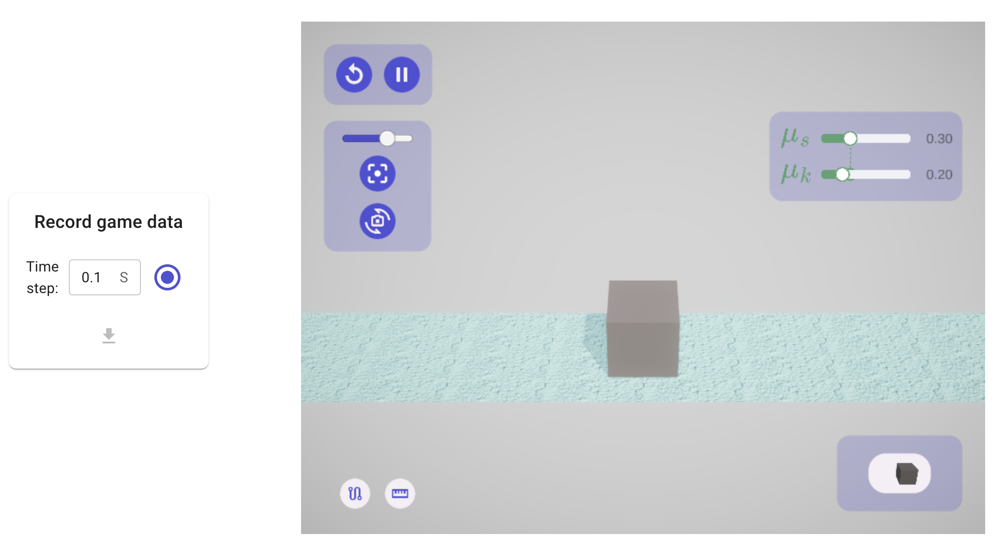
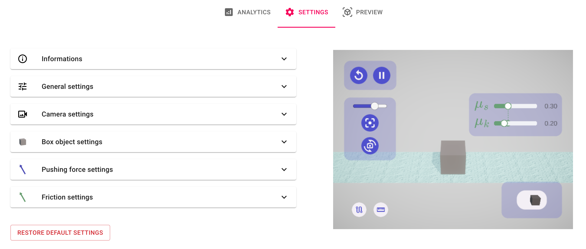

# Graasp Unity friction box

This repository hosts the code for the Unity Friction Box physics simulation app developed by [Théo Damiani](https://github.com/theo-damiani).

## Screenshots


This is the view that students see, where they can play with the simulation.


This is the view that the teachers have where they can set the simulation settings, decide which affordances to show etc.

## Installation

Run `yarn` to install dependencies.

## Running the app

Create a `.env.development` file with the following content:

```bash
VITE_PORT=3005
VITE_API_HOST=http://localhost:3000
VITE_ENABLE_MOCK_API=true
# Get one at: https://www.uuidgenerator.net/version4
VITE_GRAASP_APP_KEY=<random UUID v4 value>
VITE_VERSION=latest
```

## Running the tests

Create a `.env.test` file with the following content:

```bash
VITE_PORT=3333
VITE_API_HOST=http://localhost:3636
VITE_ENABLE_MOCK_API=true
# Get one at: https://www.uuidgenerator.net/version4
VITE_GRAASP_APP_KEY=<random UUID v4 value>
VITE_VERSION=latest

# dont open browser
BROWSER=none
```
